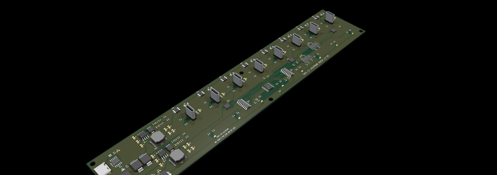
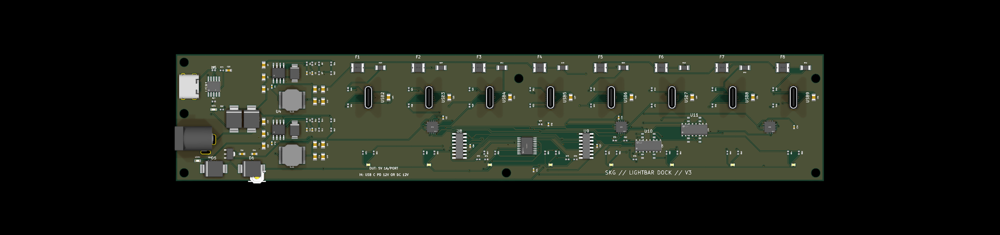
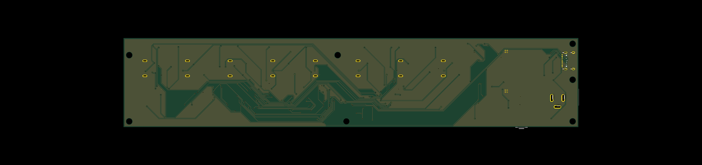
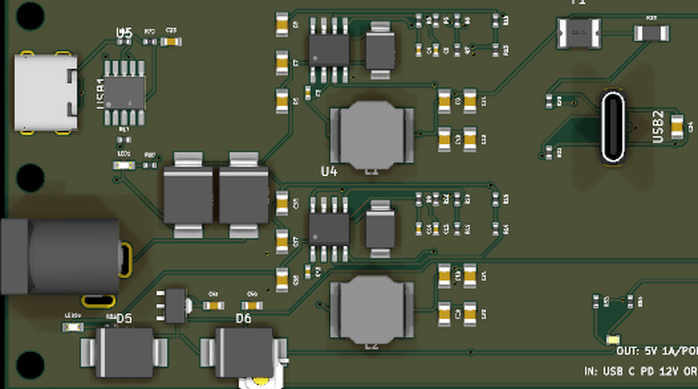
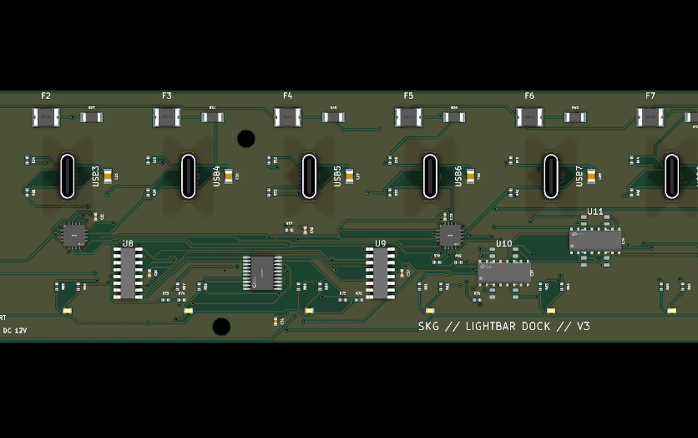

# lightbar-dock

A 1×8 USB-C charging dock for stick-anywhere rechargeable light bars. Bars
plug vertically onto upward-facing USB-C plugs; each port has a red/green
status LED driven from measured charge current and CC attach.



## Specs (single source of truth)

**[`docs/SPECS.md`](docs/SPECS.md)** — product, power budget, per-port channel,
indicators, and mechanical notes.

Do not copy those numbers into other markdown files; link to SPECS instead.

| Concern | Where |
| --- | --- |
| Schematic / PCB | `circuit/` (`circuit/index.circuit.tsx`) |
| Thresholds / timing | `firmware/status-controller/include/status_config.h` |
| MCU pin map / flash | `firmware/status-controller/README.md` |
| Fab gates / IC sign-off | `docs/DESIGN_ASSURANCE.md` |
| Order checklist | `ORDERING.md` |
| Rev‑1 history | `docs/HISTORY.md` |

## Architecture (overview)





(Diagram sources: `docs/*.mmd`. Regenerate with
`npx @mermaid-js/mermaid-cli -i docs/diagram-power.mmd -o docs/images/diagram-power.svg -t neutral -b white`.)

V3 keeps the dual-buck power path and vertical charge plugs; status is
**CH32V203F6P6** + INA3221 + CC muxes + common-anode RGB LEDs (not LM339).
Details: [`docs/SPECS.md`](docs/SPECS.md).

## Board

Top-down: power input and bucks on the left, eight ports on 22.5 mm pitch,
status LEDs on the front edge aligned with each receptacle:









Routed V3 copper / 3D exports (when regenerated): `docs/images/v3-routed-*`,
`generated/renders/`, `generated/kicad/v3-routed.kicad_pcb`.

## Toolchain

- Node.js 24+, npm, packages from `package-lock.json`
- tscircuit `0.0.2096` (pinned)
- KiCad 10 CLI for DRC / SVG / STEP / gerbers
- RISC-V GCC + pinned ch32fun for MCU firmware
- **Topola** (Rust Specctra autorouter) via git submodule `third_party/topola`
- Java 25+ + `third_party/freerouting/` as emergency fallback only

## Workflow

```sh
npm ci
git submodule update --init --recursive
npm run verify          # test + tsci check + build + electrical + vias
npm run route:circuit   # Topola multilayer Specctra route → generated/kicad/
npm run route:finish    # grid A* for leftover ratsnest (safe on pre-routed boards)
# npm run route:freerouting   # fallback
npm run autoroute:server      # optional: tscircuit HTTP adapter on :3099
npm run export:kicad
/Applications/KiCad/KiCad.app/Contents/MacOS/kicad-cli pcb drc \
  --exit-code-violations \
  -o generated/reports/tscircuit-kicad-drc.rpt \
  generated/kicad/default.kicad_pcb
```

tscircuit editor autorouting: see [`packages/topola-autorouter/README.md`](packages/topola-autorouter/README.md).
Manufacturing boards still go through KiCad Specctra (`route:circuit`).

Circuit JSON → `build/`. Manufacturing exports → `generated/`. Refresh `fab/`
from those exports only after DRC is manufacturing-clean. See
[`docs/DESIGN_ASSURANCE.md`](docs/DESIGN_ASSURANCE.md) and
[`ORDERING.md`](ORDERING.md).

### Status-controller firmware

```sh
./scripts/fetch-ch32fun.sh
make -C firmware/status-controller verify-ch32fun build
# Flash: USB1 + BOOT0 (wchisp) — firmware/status-controller/README.md
```

## Fabrication

Order V3 from `generated/` (or a refreshed `fab/`) after `npm run verify` and
KiCad DRC. JLCPCB: 2-layer / 1 oz, PCBA top side, BOM + CPL; review every
footprint in their placement preview (vertical USB-C plugs and buck ICs).

Full checklist: [`ORDERING.md`](ORDERING.md).

## Known part caveats

- **Vertical plug (C399938)**: verify gender/orientation against the
  datasheet 3D model (or LCSC samples) before a full run. 24P alt: C2763096.
- **C399938 positioning slots**: manufacturer footprint uses 0.60 × 1.80 mm
  plated slots; production tabs can sit loose in reflow. Measure tabs before
  tightening slots (tab max + ~0.10 mm width / 0.15–0.20 mm length, within
  JLC plated-slot tolerance).
- **3D model for C399938**: repo includes a datasheet-built STEP under
  `parts/Jing_Extension_of_the_Electronic_Co_918_118A2021Y40006/`.
- The plug is not structural — the printed shell must cradle the bars.
- Barrel jack pin 3 (insertion detect) is intentionally unconnected.
